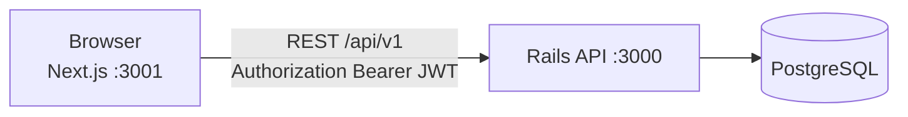
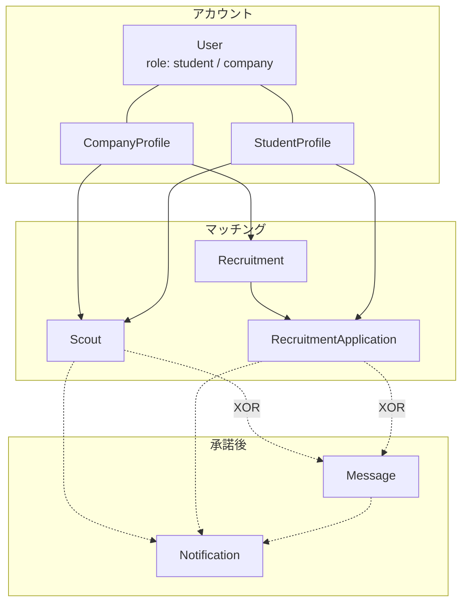

# インターンマッチ

学生と企業をつなぐインターンマッチングサービスです。企業からのスカウトと、学生からの募集応募を同じ状態機械で扱い、承諾後にチャットが開きます。

このリポジトリはモノレポです。

- [`backend/`](backend/README.md) … Ruby on Rails（API モード）
- [`frontend/`](frontend/README.md) … Next.js（App Router / TypeScript / Tailwind CSS）

起動手順・シード・画面一覧は各ディレクトリの README にあります。

## 構成の意図

フロントと API を分けることで、認証・認可・ドメインルールをサーバ側に閉じ、UI はロールごとの画面組み立てに集中しています。開発時は API を `localhost:3000`、フロントを `localhost:3001` に分け、CORS でフロントオリジンだけを許可します。

認証は bcrypt（`has_secure_password`）と JWT です。トークンは `secret_key_base` で HS256 署名し、有効期限は 24 時間です。ログイン後のリクエストは `Authorization: Bearer <token>` を付けます。

## ドメイン: 双方向マッチングを対称にする

マッチングには 2 本の導線があります。向きは逆ですが、状態とチャット解禁の条件は揃えています。

| 導線 | 起点 | 一意制約 | 承諾後 |
| --- | --- | --- | --- |
| スカウト | 企業 → 学生 | 同一企業 × 同一学生は 1 件 | チャット |
| 応募 | 学生 → 企業の募集 | 同一募集 × 同一学生は 1 件 | チャット |

どちらもステータスは `sent` / `accepted` / `declined` です。応答は一度きりで、送信済み以外への更新は拒否します。チャットは承諾済みスレッドの参加者だけが読めます。募集は `published` / `closed` で、応募できるのは公開中のみです。

ロールは STI にしていません。`User.role` と 1 対 1 のプロフィールテーブルに分け、学生用・企業用の項目を混在させないためです。新規登録は nested attributes でユーザーとプロフィールを同時に作ります。プロフィールがないロール操作は 403 です。

## 認可: 同じ URL でも返す形をロールで分ける

認可は `Api::V1::BaseController` に寄せています。

- `authenticate_user!` … JWT 必須
- `require_company!` / `require_student!` … ロールとプロフィール必須

エンドポイントはロールで増やさず、同じリソースでもペイロードを変えます。

- `GET /api/v1/scouts` … 企業は送信済みと学生情報、学生は受信と企業情報
- `GET /api/v1/recruitments` … 企業は自社募集、学生は公開中の募集と企業情報
- `GET /api/v1/applications` … 企業は自社募集への応募、学生は自分の応募

書き込みも向きを固定しています。スカウト作成は企業、承諾/辞退は学生。応募作成は学生、承諾/辞退は企業。メッセージは承諾済みスレッドの参加者だけです。

学生検索（企業のみ）は氏名・大学・自己 PR の部分一致、学年、希望勤務地、GitHub / スキル / 資格 / インターン経験の有無で絞り込みます。キーワードは `sanitize_sql_like`、勤務地は都道府県ホワイトリストとの積集合にして、LIKE インジェクションと不正値を避けています。

## データ整合: アプリと DB の両方で縛る

チャットの親はスカウトか応募のどちらか一方です。`messages` テーブルに XOR の check constraint を置き、モデルでも `scout.present? ^ recruitment_application.present?` を検証します。コントローラは親を `@thread` として扱い、一覧・投稿・相手への通知を共通化しています。

通知はポリモーフィック（`notifiable`）です。対象はスカウト、応募、メッセージです。フロントが型を分岐しなくて済むよう、API が `scout_id` / `application_id` を解決して返します。メッセージ通知なら親スレッドの ID です。

そのほかの制約です。

- メール一意、プロフィールはユーザーに対して一意
- スカウトは企業 × 学生で一意、応募は募集 × 学生で一意
- 外部キーは `on_delete: :cascade`
- 希望勤務地・稼働曜日は JSON 文字列として正規化し、フロントで配列に戻す

## フロント: ロール分岐と通知からの復帰

JWT はローカルストレージに持ち、`AuthProvider` が起動時に `GET /api/v1/me` で復元します。401 ならトークンを捨ててログインへ戻します。API クライアントは `lib/api.ts`、型は `lib/types.ts` にまとめています。

`/dashboard` はロールで中身を切り替えます。学生は受信スカウトと募集検索、企業は学生検索・募集管理・応募一覧です。チャット UI（`ChatModal`）はスカウト ID と応募 ID のどちらでも開きます。

通知は約 30 秒間隔のポーリングです。クリックするとクエリ（`scoutId` / `chatScoutId` / `applicationId` / `chatApplicationId`）付きでダッシュボードへ飛び、該当タブとモーダルを開いてからクエリを消します。WebSocket は使っていません。マッチングの状態遷移を先に固める判断です。

## 技術スタック

| 層 | 技術 |
| --- | --- |
| Backend | Ruby 3.4.10 / Rails 8.1（API モード） / Puma |
| 認証 | bcrypt / JWT |
| Database | PostgreSQL |
| Frontend | Next.js 16（App Router） / React 19 / TypeScript / Tailwind CSS 4 |
| 通信 | REST `/api/v1` |

## 起動

1. [backend/README.md](backend/README.md) で API を `http://localhost:3000` に起動する
2. [frontend/README.md](frontend/README.md) で UI を `http://localhost:3001` に起動する

Docker Compose は用意していません。

## 意図的にやらないこと

- 本番デプロイ、Docker、メール送信、パスワード再設定
- チャットのリアルタイム更新（開いたときと送信時に取得）
- 一覧のページネーション
- フロントエンドの自動テスト
